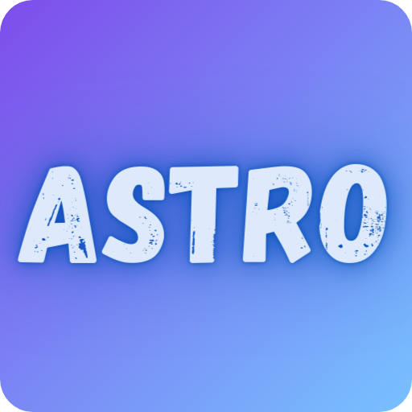

    
     
    <h1>Friday Night Funkin' • <code>Astro Engine</code> (<strong>Beta</strong>)</h1>
         
    
    
     
     
 UPDATE HAXE TO 4.2.5 rn NOW BOIII  

Hello, this is a modified version of the **Psych Engine** that includes events and functions missing from the original engine.

## Installation:

open up a Command Prompt/PowerShell or Terminal, type `haxelib install hmm`

after it finishes, simply type `haxelib run hmm install` in order to install all the needed libraries for _Psych Engine!_

---

<h2>Credits:</h2>

**[HackTheAir](https://twitter.com/AnimatesHack)** - Main **Programmer**

---

<h2>Psych Engine Credits::</h2>

**Shadow Mario** - Main **Programmer** 
**RiverOaken** - Artist 
**Yoshubs** - Assistant **Programmer** 
**bbpanzu** - Ex-**Programmer** 

---

